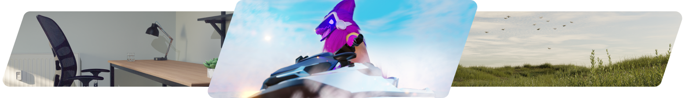
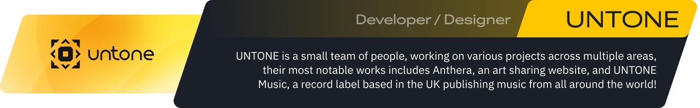
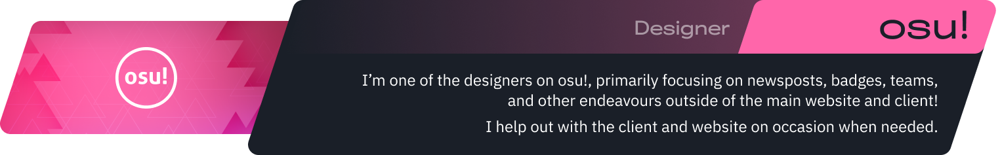
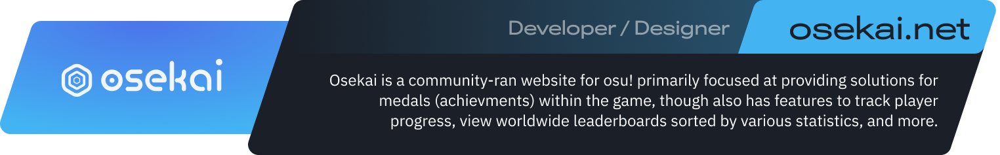

<h1 align="center" width="100%">
Hi, I'm Tanza!
</h1>
<h3 align="center" width="100%">
  I'm a web developer and more so designer working on loads of projects across the web!
</h3>

  I also work on 3d art, which you can find a gallery of <a href="https://tanza.me/gallery">here!</a>

  <a href="https://bsky.app/profile/tanza.me"></img></a>
  <a href="https://tanza.me/portfolio"></img></a>
  <a href="https://tanza.me/gallery"></img></a>

 
<h1 align="center" width="100%">
    Main Projects/Contributions
</h1>

